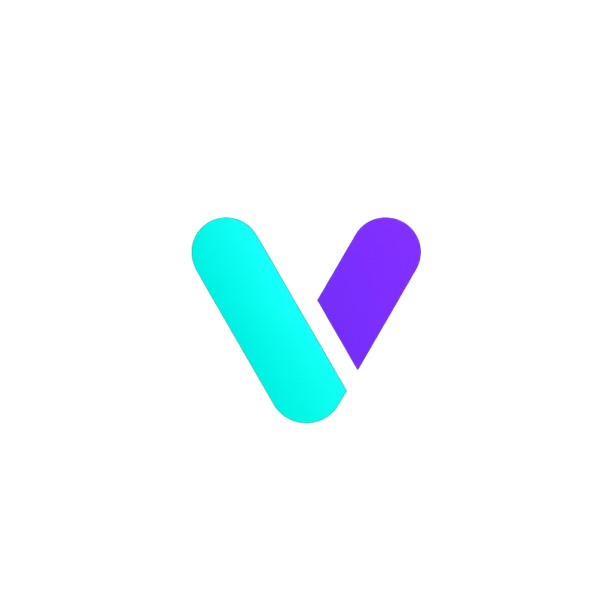

<p align="center">
<a href="https://discord.gg/NJNbafHNQC">

</a>
</p>

## What is Vrabby?

Vrabby is a powerful Next.js-based web app builder that combines **C**laude Code's (Cursor CLI also supported!) advanced
AI agent capabilities with **Lovable**'s simple and intuitive app building experience. Just describe your app idea - "I
want a task management app with dark mode" - and watch as Vrabby instantly generates the code and shows you a live
preview of your working app. You can deploy your app to Vercel and integrate database with Supabase for free.

This open-source project empowers you to build and deploy professional web applications easily for **free**.

How to start? Simply login to Claude Code (or Cursor CLI), start Vrabby, and describe what you want to build. That's it.
There is no additional subscription cost for app builder.

## Requirements

- Python 3.12 recommended (3.11 or 3.10 also supported). Python 3.14 is not yet supported by some dependencies.
  - Windows: Install Python 3.12 and use the py launcher
    - Create venv: `py -3.12 -m venv apps\api\.venv`
    - Install deps: `apps\api\.venv\Scripts\pip install -r apps\api\requirements.txt`
  - macOS/Linux:
    - Create venv: `python3.12 -m venv apps/api/.venv`
    - Install deps: `apps/api/.venv/bin/pip install -r apps/api/requirements.txt`
- Node.js >= 18 and npm >= 9

## Features


- **Powerful Agent Performance**: Leverage the full power of Claude Code and Cursor CLI Agent capabilities with native
  MCP support
- **Natural Language to Code**: Simply describe what you want to build, and Vrabby generates production-ready Next.js
  code
- **Instant Preview**: See your changes immediately with hot-reload as AI builds your app
- **Zero Setup, Instant Launch**: No complex sandboxes, no API key, no database headaches - just start building
  immediately
- **Beautiful UI**: Generate beautiful UI with Tailwind CSS and shadcn/ui
- **Deploy to Vercel**: Push your app live with a single click, no configuration needed
- **GitHub Integration**: Automatic version control and continuous deployment setup
- **Supabase Database**: Connect production PostgreSQL with authentication ready to use
- **Automated Error Detection**: Detect errors in your app and fix them automatically

## Demo Examples

### Codex CLI Example


### Qwen Code Example


## Supported AI Coding Agents

Vrabby supports multiple AI coding agents, giving you the flexibility to choose the best tool for your needs:

- **Claude Code** - Anthropic's advanced AI coding agent
- **Codex CLI** - OpenAI's lightweight coding agent
- **Cursor CLI** - Powerful multi-model AI agent
- **Gemini CLI** - Google's open-source AI agent
- **Qwen Code** - Alibaba's open-source coding CLI

### Claude Code (Recommended)

**[Claude Code](https://docs.anthropic.com/en/docs/claude-code/setup)** - Anthropic's advanced AI coding agent with
Claude Opus 4.1

- **Features**: Deep codebase awareness, MCP support, Unix philosophy, direct terminal integration
- **Context**: Native 256K tokens
- **Pricing**: Included with ChatGPT Plus/Pro/Team/Edu/Enterprise plans
- **Installation**:
  ```bash
  npm install -g @anthropic-ai/claude-code
  claude  # then > /login
  ```

### Codex CLI

**[Codex CLI](https://github.com/openai/codex)** - OpenAI's lightweight coding agent with GPT-5 support

- **Features**: High reasoning capabilities, local execution, multiple operating modes (interactive, auto-edit,
  full-auto)
- **Context**: Varies by model
- **Pricing**: Included with ChatGPT Plus/Pro/Business/Edu/Enterprise plans
- **Installation**:
  ```bash
  npm install -g @openai/codex
  codex  # login with ChatGPT account
  ```

### Cursor CLI

**[Cursor CLI](https://cursor.com/en/cli)** - Powerful AI agent with access to cutting-edge models

- **Features**: Multi-model support (Anthropic, OpenAI, Gemini), MCP integration, AGENTS.md support
- **Context**: Model dependent
- **Pricing**: Free tier available, Pro plans for advanced features
- **Installation**:
  ```bash
  curl https://cursor.com/install -fsS | bash
  cursor-agent login
  ```

### Gemini CLI

**[Gemini CLI](https://developers.google.com/gemini-code-assist/docs/gemini-cli)** - Google's open-source AI agent with
Gemini 2.5 Pro

- **Features**: 1M token context window, Google Search grounding, MCP support, extensible architecture
- **Context**: 1M tokens (with free tier: 60 req/min, 1000 req/day)
- **Pricing**: Free with Google account, paid tiers for higher limits
- **Installation**:
  ```bash
  npm install -g @google/gemini-cli
  gemini  # follow authentication flow
  ```

### Qwen Code

**[Qwen Code](https://github.com/QwenLM/qwen-code)** - Alibaba's open-source CLI for Qwen3-Coder models

- **Features**: 256K-1M token context, multiple model sizes (0.5B to 480B), Apache 2.0 license
- **Context**: 256K native, 1M with extrapolation
- **Pricing**: Completely free and open-source
- **Installation**:
  ```bash
  npm install -g @qwen-code/qwen-code@latest
  qwen --version
  ```

## Technology Stack

**Database & Deployment:**

- **[Supabase](https://supabase.com/)**: Connect production-ready PostgreSQL database directly to your project.
- **[Vercel](https://vercel.com/)**: Publish your work immediately with one-click deployment

**There is no additional subscription cost and built just for YOU.**

## Prerequisites

Before you begin, ensure you have the following installed:

- Node.js 18+
- Python 3.10+
- Claude Code or Cursor CLI (already logged in)
- Git

## Quick Start

Get Vrabby running on your local machine in minutes:

```bash
# Clone the repository
git clone https://github.com/opactorai/Vrabby.git
cd Vrabby

# Install all dependencies (Node.js and Python)
npm install

# Start development servers
npm run dev
```

Your application will be available at:

- Frontend: http://localhost:3000
- API Server: http://localhost:8080
- API Documentation: http://localhost:8080/docs

**Note**: Ports are automatically detected. If the default ports are in use, the next available ports will be assigned.

## Setup

### Manual Setup

You can also manually setup the project.

```bash
# Frontend setup
cd apps/web
npm install

# Backend setup
cd ../api
python3 -m venv .venv
source .venv/bin/activate  # On Windows: .venv\Scripts\activate
pip install -r requirements.txt
```

The `npm install` command automatically handles the complete setup:

1. **Port Configuration**: Detects available ports and creates `.env` files
2. **Node.js Dependencies**: Installs packages including workspace dependencies
3. **Python Environment**: Creates virtual environment in `apps/api/.venv`
4. **Python Dependencies**: Installs packages using `uv` (if available) or `pip`
5. **Database Setup**: SQLite database auto-creates at `data/cc.db` on first run

### Additional Commands

```bash
npm run db:backup   # Create a backup of your SQLite database
                    # Use when: Before major changes or deployments
                    # Creates: data/backups/cc_backup_[timestamp].db

npm run db:reset    # Reset database to initial state
                    # Use when: Need fresh start or corrupted data
                    # Warning: This will delete all your data!

npm run clean       # Remove all dependencies and virtual environments
                    # Use when: Dependencies conflict or need fresh install
                    # Removes: node_modules/, apps/api/.venv/, package-lock.json
                    # After running: npm install to reinstall everything
```

## Usage

### Getting Started with Development

1. **Connect Claude Code**: Link your Claude Code CLI to enable AI assistance
2. **Describe Your Project**: Use natural language to describe what you want to build
3. **AI Generation**: Watch as the AI generates your project structure and code
4. **Live Preview**: See changes instantly with hot reload functionality
5. **Deploy**: Push to production with Vercel integration

### API Development

Access the interactive API documentation at http://localhost:8080/docs to explore available endpoints and test API
functionality.

### Database Operations

Vrabby uses SQLite for local development and can be configured for PostgreSQL in production. The database automatically
initializes on first run.

## Troubleshooting

### Port Already in Use

The application automatically finds available ports. Check the `.env` file to see which ports were assigned.

### Installation Failures

```bash
# Clean all dependencies and retry
npm run clean
npm install
```

### Permission Errors (macOS/Linux)

If you encounter permission errors:

```bash
cd apps/api
python3 -m venv .venv
source .venv/bin/activate
pip install -r requirements.txt
```

### Claude Code Permission Issues (Windows/WSL)

If you encounter the error:
`Error output dangerously skip permissions cannot be used which is root sudo privileges for security reasons`

**Solution:**

1. Do not run Claude Code with `sudo` or as root user
2. Ensure proper file ownership in WSL:
   ```bash
   # Check current user
   whoami
   
   # Change ownership of project directory to current user
   sudo chown -R $(whoami):$(whoami) ~/Vrabby
   ```
3. If using WSL, make sure you're running Claude Code from your user account, not root
4. Verify Claude Code installation permissions:
   ```bash
   # Reinstall Claude Code without sudo
   npm install -g @anthropic-ai/claude-code --unsafe-perm=false
   ```

## Integration Guide

### GitHub

**Get Token:** [GitHub Personal Access Tokens](https://github.com/settings/tokens) → Generate new token (classic) →
Select `repo` scope

**Connect:** Settings → Service Integrations → GitHub → Enter token → Create or connect repository

### Vercel

**Get Token:** [Vercel Account Settings](https://vercel.com/account/tokens) → Create Token

**Connect:** Settings → Service Integrations → Vercel → Enter token → Create new project for deployment

### Supabase

**Get Credentials:** [Supabase Dashboard](https://supabase.com/dashboard) → Your Project → Settings → API

- Project URL: `https://xxxxx.supabase.co`
- Anon Key: Public key for client-side
- Service Role Key: Secret key for server-side

## License

MIT License.

## Upcoming Features

These features are in development and will be opened soon.

- **New CLI Agents** - Trust us, you're going to LOVE this!
- **Checkpoints for Chat** - Save and restore conversation/codebase states
- **Advanced MCP Integration** - Native integration with MCP
- **Enhanced Agent System** - Subagents, AGENTS.md integration
- **Website Cloning** - You can start a project from a reference URL.
- Various bug fixes and community PR merges

We're working hard to deliver the features you've been asking for. Stay tuned!

## Star History

[](https://www.star-history.com/#opactorai/Vrabby&Date)


## Content pages (Blog, FAQ, Pricing)
This app reads content directly from your Supabase database. Use your separate Admin project to manage these tables:

Tables and columns (suggested):
- blogs
  - id (uuid or text, pk)
  - title (text)
  - slug (text, unique, nullable)
  - excerpt (text)
  - image_url (text)
  - created_at (timestamp with time zone, default now())
  - published (bool, default true)
- faq_items
  - id (uuid or text, pk)
  - question (text)
  - answer (text, HTML allowed)
  - order (int)
  - published (bool, default true)
- pricing_plans
  - id (uuid or text, pk)
  - slug (text, unique)
  - name (text)
  - price_eur (numeric)
  - credits (int)
  - blurb (text)
  - stripe_price_id (text) — the Stripe Price ID used for subscriptions
  - is_most_popular (bool)
  - sort (int)
  - published (bool, default true)
- pricing_features
  - id (uuid or text, pk)
  - plan_id (fk -> pricing_plans.id)
  - text (text)
  - tag (text, nullable)

Pages implemented:
- /blog: 1-column list, 5 per page with pagination, shows image, title, excerpt, date.
- /faq: collapsible items.
- /pricing: plan cards with features and a Subscribe button.

Stripe integration:
- The Subscribe button calls your backend billing endpoint `/api/billing/create-checkout-session` using the signed-in Supabase session token.
- Set NEXT_PUBLIC_API_BASE in apps/web/.env.local to enable checkout in dev (auto-written by scripts/setup-env.js).


## Backend architecture (clean architecture overview)

The FastAPI backend follows a layered, modular structure for scalability and maintainability:

- app/api: Thin route handlers (FastAPI routers). All business logic delegated to services.
- app/services: Application/service layer encapsulating business rules and workflows.
- app/repositories: Data access layer (SQLAlchemy, async). Repositories perform DB I/O.
- app/models: SQLAlchemy ORM models and database schema definitions.
- app/db: Database configuration (sync and async engines, sessions) and migrations wiring.
- app/core: Cross-cutting concerns (config, logging, error handling, exceptions, terminal UI).

Key practices implemented:
- Async database I/O with SQLAlchemy AsyncSession (asyncpg) to avoid blocking the event loop.
- Centralized error handling via app.core.error_handlers.register_exception_handlers (HTTPException, ServiceError, validation, SQL errors, generic fallback).
- Service layer (e.g., UsersService) to keep API routes thin and testable.
- Repository layer (UsersRepository, BillingRepository) for database access.
- Automatic OpenAPI docs at /docs and /redoc.

Development notes:
- DATABASE_URL can use postgres:// or postgresql://; the system normalizes it for SQLAlchemy. The async engine auto-converts to postgresql+asyncpg.
- Alembic migrations continue to use the sync engine; runtime routes can use async sessions concurrently.
- New async dependency: app.api.deps_async.get_db_async yields an AsyncSession for use in async routes/services.


### Debug mode

You can enable verbose logs across the stack with a single flag:

- Backend: set `DEBUG=true` (or `1/yes/on`) in `.env`.
- Frontend: `scripts/setup-env.js` mirrors this to `apps/web/.env.local` as `NEXT_PUBLIC_DEBUG=true`.
- Effects:
  - Backend logging switches to debug/info and enables stdout stream handler; Uvicorn starts with `--log-level info`.
  - Terminal UI (rich panels, ASCII logo, info/success messages) is shown only in debug; otherwise only warnings/errors are printed.
  - Frontend `logger` wrapper gates all `console.*` calls so noisy logs only appear when `NEXT_PUBLIC_DEBUG=true`.

Tips:
- Keep `DEBUG=false` in production for minimal noise and better performance.
- Toggle and re-run `npm run dev` to apply.
